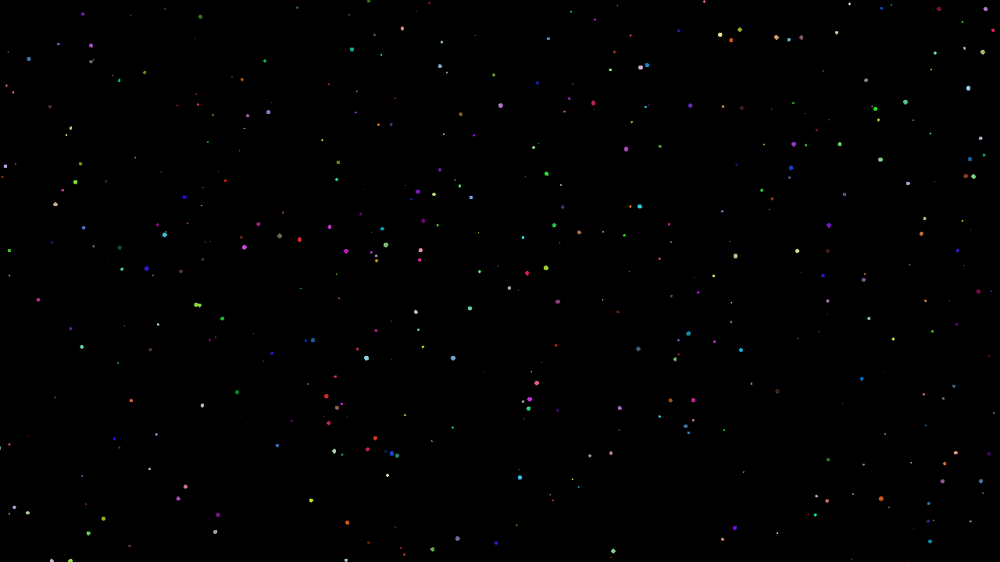

# shooting-stars

shooting-stars - a simple graphical app that creates an everlasting stream of colored stars.



## Build

1. Clone this project and then cd to the project folder;

2. Init the sfml git submodule:
```
$ git submodule init
$ git submodule update --init --recursive
```

3. Configure the project using CMake:
```
$ cmake -B ./build -G <preferred generator>
```

4. Then run build command:
```
$ cmake --build ./build --config <Debug|Release>
```

5. You've done! The builded binary file available in the build directory.

## License

This project is licensed under the [MIT License](LICENSE).

## Credits

My thanks to the developers of the [SFML](https://github.com/SFML/SFML).